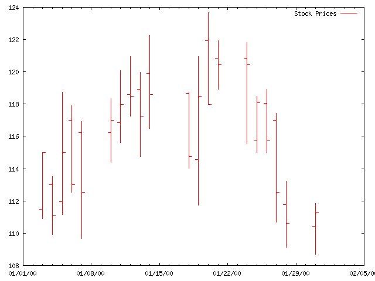

# Perl-Scripts
 [Marygrove College](http://www.marygrove.edu/) offers some online courses as well. I took an Introduction to Perl course that was very interesting 

 The course covered everything from printing hello to STDOUT to references, regex, objects, subroutines, and the perl debugger. Being somewhat familiar with regex, I've found the little scripts that you can do with perl are immensly useful as a way to break up, sort, and organize data. In some ways it is similar to awk and sed, but perl is a fully fleshed out scripting language. 

  

 Above is a screenshot of editing a perl script in Vim. The script takes in a comma delimited text file of what could be stock price values and outputs the date and price change in a nice, human readable format. 

 That example script can be downloaded [here ](prices_pl.txt target=). 

 Some sample data is [ here ](prices.txt). 

 There's another little script [ here ](listdir_obj.pl) that uses a perl object to list the directories in a folder. 

 Finally, the last few chapters of the course go through using perl as part of three teir architectures, and then finally subroutines and subroutine references. 

 [ Here ](tables_sub.pl) is a script that shows an example of using subroutine references to call a different subroutine depending on the arguments passed to the function. 
